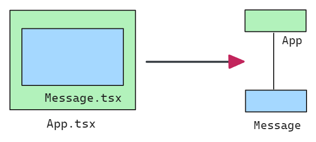
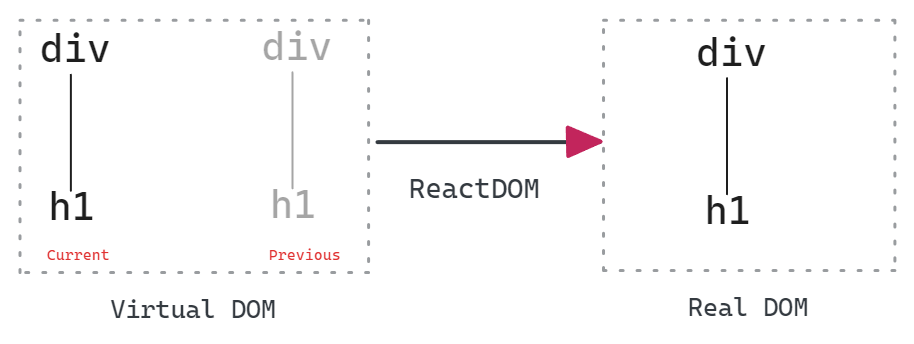
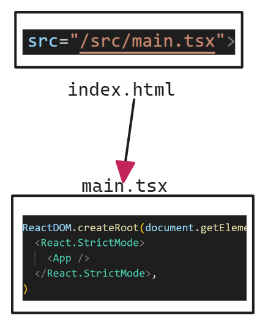

# React 学习笔记

> -   课程：[React Tutorial for Beginners - YouTube](https://www.youtube.com/watch?v=SqcY0GlETPk&t=0s&ab_channel=ProgrammingwithMosh)
> -   作者：Programming with Mosh
> -   时长：1:20:03
> -   计划：1-2 天
> -   周期：2023/07/10 ~ 2023/07/13
> -   资源：
> -   备注：居然花了 3 天，1 个多小时的视频。后续一定想办法提升效率 😭

## 创建 React app

```bash
npm create vite@4.1.0
```

选择

```markdown
Proceed?: y
Project name: react-app
framework: React
variant: Typescript
```

```bash
# 安装依赖
npm i
# 运行服务
npm run dev
```

## 项目结构说明

```markdown
.
├── node_modules/ # 三方依赖包下载位置
├── public/ # 公共资源文件夹（图片，视频...）
├── src/ # 源代码文件夹
├── index.html # html 模板
├── package.json # 项目配置文件
├── tsconfig.json # typescript 配置文件
└── vite.config.ts # vite 配置文件
```

## 创建 react component

创建一个 `Message`组件

src\Message.tsx

```tsx
/* 
文件后缀说明
- tsx 用于 react 中的 component
- ts  用于一般的 ts文件

编写组件的方式
- 函数 function （普遍使用，推荐）
- 类 class 
 */
function Message() {
	// JSX: JavaScript XML
	// Converting tool:https://babeljs.io/repl
	const name = 'Nathan';
	if (name) return <h1>Hello {name}</h1>;
	return <h1>Hello React</h1>;
}
// 导出
export default Message;
```

在组件 `App.tsx`中引入

src\App.tsx

```tsx
import Message from './Message';

function App() {
	return (
		<div>
			<Message />
		</div>
	);
}
export default App;
```

## React 工作原理

在`App.tsx`组件中引入一个作为子组件的`Message.tsx`组件可以看作为如下的（右）的树形结构



而 React 中一个组件实际上是一个虚拟 DOM（Virtual DOM），通过 ReactDom 转换为 真实 DOM（Real DOM ）。具体是通过对比前后的虚拟 DOM 的差异，选择渲染（转换）为真实 DOM。



上述的 `ReactDom`可以从 `package.json` 中查看

```json
"dependencies": {
    "react": "^18.2.0",
    "react-dom": "^18.2.0"
},
```

代码层面的转换过程是在 `index.html`中引入了`main.tsx`文件，此文件中包含将组件从虚拟 DOM 转为 真实 DOM 代码



完整代码如下：

index.html

```html
<body>
	<div id="root"></div>
	<script
		type="module"
		src="/src/main.tsx"
	></script>
</body>
```

src\main.tsx

```tsx
ReactDOM.createRoot(document.getElementById('root') as HTMLElement).render(
	<React.StrictMode>
		<App />
	</React.StrictMode>
);
```

## 创建 ListGroup 组件

使用的 UI 框架：https://getbootstrap.com/docs/5.3/getting-started/introduction/

安装 bootstrapUI 框架

```bash
$ npm i bootstrap@5.2.3
```

修改使用的样式文件，采用 bootstrap

src\main.tsx

```diff
- import './index.css'
+ import "bootstrap/dist/css/bootstrap.css";
```

创建新的组件 ListGroup

src\components\ListGroup.tsx

```jsx
function ListGroup() {
	return (
		<ul className='list-group'>
			<li className='list-group-item'>An item</li>
			<li className='list-group-item'>A second item</li>
			<li className='list-group-item'>A third item</li>
			<li className='list-group-item'>A fourth item</li>
			<li className='list-group-item'>And a fifth one</li>
		</ul>
	);
}
export default ListGroup;
```

修改组件从 Message 为 ListGroup

src\App.tsx

```jsx
import ListGroup from './components/ListGroup';
function App() {
	return (
		<div>
			<ListGroup />
		</div>
	);
}
export default App;
```

## Fragment

使用 Fragment 之前

```jsx
function ListGroup() {
	return (
		<h1>List Group</h1>
		<ul className='list-group'>
			<li className='list-group-item'>An item</li>
			<li className='list-group-item'>A second item</li>
			<li className='list-group-item'>A third item</li>
			<li className='list-group-item'>A fourth item</li>
			<li className='list-group-item'>And a fifth one</li>
		</ul>
	);
}
export default ListGroup;
```

使用 Fragment 之后

```jsx
import { Fragment } from 'react';

function ListGroup() {
	return (
		<Fragment>
			<h1>List Group</h1>
			<ul className='list-group'>
				<li className='list-group-item'>An item</li>
				<li className='list-group-item'>A second item</li>
				<li className='list-group-item'>A third item</li>
				<li className='list-group-item'>A fourth item</li>
				<li className='list-group-item'>And a fifth one</li>
			</ul>
		</Fragment>
	);
}
export default ListGroup;
```

简单来说 `Fragment`就是一个特殊作用的标签，本身不作为 `DOm`渲染，作用是保证符合 React 语法——返回的组件的元素（标签）只有一个通过包裹已有的多个元素。

## 列表渲染

```jsx
import { Fragment } from 'react';

function ListGroup() {
	const citiesItems = [
		'New York',
		'San Francisco',
		'Tokyo',
		'London',
		'Paris',
	];
	return (
		<Fragment>
			<h1>List Group</h1>
			<ul className='list-group'>
				{citiesItems.map((item) => (
					<li key={item}>{item}</li>
				))}
			</ul>
		</Fragment>
	);
}
export default ListGroup;
```

## 条件渲染

```jsx
import { Fragment } from 'react';

function ListGroup() {
	let citiesItems = ['New York', 'San Francisco', 'Tokyo', 'London', 'Paris'];
	citiesItems = [];
	return (
		<Fragment>
			<h1>List Group</h1>
			{/* {citiesItems.length === 0 ? <p>No item found</p> : null} */}
			{citiesItems.length === 0 && <p>No item found</p>}
			<ul className='list-group'>
				{citiesItems.map((item) => (
					<li key={item}>{item}</li>
				))}
			</ul>
		</Fragment>
	);
}
export default ListGroup;
```

关于动态渲染的一个语法技巧：

三元运算符：`C?A:null`

等价于

与逻辑运算：`C && A`

上述的例子中是仅希望当条件（C）成立时，渲染 A 的结果，后面的`null`只是为了为了符合三元运算符的语法的补充。在这种情况下，利用逻辑与（&&）运算符的特性就很适合。

对于 `A&&B`，当 A 为 true ，则返回 B，当 A 为 false ，则返回 A。

当 A 即条件成立，则返回 B；当条件不成立，返回 A。对于上述的例子来说，条件成立就返回并渲染 `<p>`标签，不成立则返回 `false`，而 `false`不会渲染任何内容。

## 事件处理

```diff
import {
Fragment,
+ MouseEvent
} from 'react';

function ListGroup() {
	let citiesItems = ['New York', 'San Francisco', 'Tokyo', 'London', 'Paris'];
	// citiesItems = [];
+	const handlerClick = (event: MouseEvent) => {
+		console.log(event);
+	};
	return (
		<Fragment>
			<h1>List Group</h1>
			{citiesItems.length === 0 && <p>No item found</p>}
			<ul className='list-group'>
				{citiesItems.map((item) => (
					<li
+						className='list-group-item'
						key={item}
+   					onClick={handlerClick}
					>
						{item}
					</li>
				))}
			</ul>
		</Fragment>
	);
}
export default ListGroup;
```

## 状态管理

src\components\ListGroup.tsx

```jsx
import { Fragment, MouseEvent, useState } from 'react';

function ListGroup() {
	let citiesItems = ['New York', 'San Francisco', 'Tokyo', 'London', 'Paris'];
	/**
	 * 创建 react 状态管理
	 * useState(...) 返回数组，长度为2
	 * arr[0] 第一个元素为状态（数据）
	 * arr[1] 第二个元素为更新状态的函数引用
	 */
	const [selectedIndex, setSelectedIndex] = useState(-1);
	return (
		<Fragment>
			<h1>List Group</h1>
			{citiesItems.length === 0 && <p>No item found</p>}
			<ul className='list-group'>
				{citiesItems.map((item, index) => (
					<li
						className={
							selectedIndex === index
								? 'list-group-item active'
								: 'list-group-item'
						}
						key={item}
						onClick={() => setSelectedIndex(index)}
					>
						{item}
					</li>
				))}
			</ul>
		</Fragment>
	);
}
export default ListGroup;
```

src\App.tsx

react 中使用 `useState()`，则每个组件有单独的状态（即使是同一个组件）

```jsx
import ListGroup from './components/ListGroup';
function App() {
	return (
		<div>
			<ListGroup />
			<ListGroup />
		</div>
	);
}
export default App;
```

## 通过 Props 传递数据

父组件传参

src\App.tsx

```jsx
import ListGroup from './components/ListGroup';
function App() {
	let items = ['New York', 'San Francisco', 'Tokyo', 'London', 'Paris'];

	return (
		<div>
			<ListGroup
				// 传入参数
				items={items}
				heading='Cities'
			/>
		</div>
	);
}
export default App;
```

子组件接收参数

src\components\ListGroup.tsx

```jsx
import { Fragment, useState } from 'react';
interface Props {
	items: string[];
	heading: string;
}
/**
 *
 * @param param0
 * items 列表项
 * heading 标题
 * @returns
 */
function ListGroup({ items, heading }: Props) {
	/**
	 * 创建 react 状态管理
	 * useState(...) 返回数组，长度为2
	 * arr[0] 第一个元素为状态（数据）
	 * arr[1] 第二个元素为更新状态的函数引用
	 */
	const [selectedIndex, setSelectedIndex] = useState(-1);
	return (
		<Fragment>
			<h1>{heading}</h1>
			{items.length === 0 && <p>No item found</p>}
			<ul className='list-group'>
				{items.map((item, index) => (
					<li
						className={
							selectedIndex === index
								? 'list-group-item active'
								: 'list-group-item'
						}
						key={item}
						onClick={() => setSelectedIndex(index)}
					>
						{item}
					</li>
				))}
			</ul>
		</Fragment>
	);
}
export default ListGroup;
```

## 通过 Props 传递函数

父组件传参

src\App.tsx

```jsx
import ListGroup from './components/ListGroup';
function App() {
	let items = ['New York', 'San Francisco', 'Tokyo', 'London', 'Paris'];
	const handleSelectItem = (item: String) => {
		console.log(item);
	};

	return (
		<div>
			<ListGroup
				// 传入参数
				items={items}
				heading='Cities'
				onSelectItem={handleSelectItem}
			/>
		</div>
	);
}
export default App;
```

子组件接收参数

src\components\ListGroup.tsx

```jsx
import { Fragment, useState } from 'react';
interface Props {
	items: string[];
	heading: string;
	onSelectItem: (item: string) => void;
}
/**
 *
 * @param param0
 * items 列表项
 * heading 标题
 * @returns
 */
function ListGroup({ items, heading, onSelectItem }: Props) {
	/**
	 * 创建 react 状态管理
	 * useState(...) 返回数组，长度为2
	 * arr[0] 第一个元素为状态（数据）
	 * arr[1] 第二个元素为更新状态的函数引用
	 */
	const [selectedIndex, setSelectedIndex] = useState(-1);
	return (
		<Fragment>
			<h1>{heading}</h1>
			{items.length === 0 && <p>No item found</p>}
			<ul className='list-group'>
				{items.map((item, index) => (
					<li
						className={
							selectedIndex === index
								? 'list-group-item active'
								: 'list-group-item'
						}
						key={item}
						onClick={() => {
							setSelectedIndex(index);
							onSelectItem(item);
						}}
					>
						{item}
					</li>
				))}
			</ul>
		</Fragment>
	);
}
export default ListGroup;
```

## Props VS State

Props

-   immutable，类似函数参数，会重新渲染

State

-   mutable，类似变量，会重新渲染

## 传递子组件

> 视频中安装 VCode 扩展：
>
> -   name : **VS Code ES7+ React/Redux/React-Native/JS snippets**
> -   author : dsznajder
> -   description : JavaScript and React/Redux snippets in ES7+ with Babel plugin features for [VS Code](https://code.visualstudio.com/)

父组件

src\App.tsx

```jsx
import Alert from './components/Alert';

function App() {
	return (
		<div>
			<Alert>
				{/* 传递子节点 */}
				Hello <span>React</span>
			</Alert>
		</div>
	);
}
export default App;
```

子组件

src\components\Alert.tsx

```jsx
// 快捷输入 rafce (React Arrow Function Component)
import React, { ReactNode } from 'react';
interface Props {
	// 如果传递的是一个节点，则需要使用 ReactNode
	children: ReactNode;
}
const Alert = ({ children }: Props) => {
	return <div className='alert alert-primary'>{children}</div>;
};

export default Alert;
```
